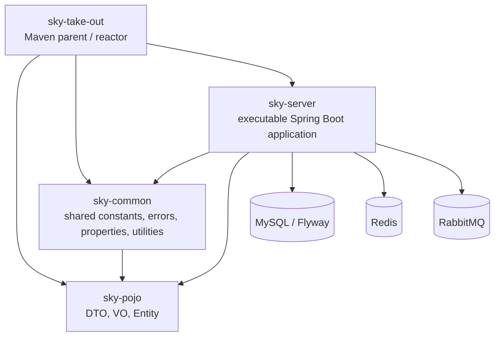

# Backend architecture and tradeoffs

The backend is a modular monolith: one Maven reactor produces one executable `sky-server` Spring Boot application. Package boundaries assign business ownership without creating separately deployable services.

## Maven module dependencies

`sky-common` depends on `sky-pojo`; `sky-server` depends directly on both. The parent aggregates modules and manages versions, but is not a runtime component.

## Business ownership

Inside `sky-server`, the enforced owners are `auth`, `product`, `inventory`, `order`, `payment`, and `notification`. Cross-module types live under `com.sky.<module>.api`; controllers, application implementations, persistence, and adapters live under the owner's `internal` packages. `ModuleBoundaryTest` enforces owner placement, API-only cross-module access, and the controller-to-mapper prohibition. See [module boundaries](module-boundaries.md).

- `order` calls inventory, product, and auth through public APIs.
- `payment` records a verified callback, invokes `OrderApplicationService`, and inserts the payment event into the Outbox in the same database transaction.
- the Outbox publisher sends committed payment-event envelopes to RabbitMQ.
- `notification` consumes events through a durable idempotency record and delegates WebSocket delivery through `OrderNotificationPort`.
- legacy memo, report, upload, and shop-status packages remain outside the declared owner layout.

## Reliability boundaries

Payment success uses a transactional Outbox. The publisher leases due rows, waits for broker confirmation, marks acknowledged events sent, retries return/NACK/exception outcomes with bounded backoff, and eventually marks exhausted events failed.

Consumers persist `(consumer_name, event_id)`. A completed duplicate returns without repeating its side effect; a conflicting or unfinished duplicate fails. Exhausted listener retries publish a sanitized record to the dead-letter exchange and persist failure evidence.

Order timeout is deliberately documented as different: order submission currently publishes the delayed message directly through `RabbitTemplate` inside the local transaction. It is implemented, but it does not have the atomic database/event guarantee of the payment Outbox.

## Tradeoffs

| Decision | Benefit | Cost / boundary |
|---|---|---|
| Modular monolith, one jar | Simple deployment and local transactions with named ownership | Isolation is enforced by tests rather than processes; one application failure affects all owners |
| Shared `sky-pojo` | Avoids duplicated transport/entity models | Central coupling means a model change can affect several owners |
| Synchronous core writes | Immediate order/inventory consistency | Longer request transactions and hot-row contention remain possible |
| Payment transactional Outbox | Committed payment state cannot lose its event because of a process gap | Delivery is at least once; polling, retry state, and idempotent consumers are required |
| Direct order-timeout publish | Preserves the existing delayed-timeout path with little machinery | Database completion and broker publication are not atomic; an Outbox migration is future scope |
| Idempotency plus confirmed DLQ | Duplicate delivery and poison messages are recoverable and observable | Requires durable consumer records and operator recovery policy |
| After-commit best-effort WebSocket | Notification failure cannot roll back the business fact | Failed/offline delivery is not replayed by this adapter |
| Private management port | Separates health/metrics from public APIs | Operators must preserve private access for probes and scraping |

This describes present source and configuration. Revision `13a1783` passed the full Docker-backed Maven suite, Compose health/persistence smoke, and rollback drill. Those local gates do not close the missing searchable end-to-end correlation record, identical-input performance repeatability, remote CI/security evidence, or Task 17 optimization evidence; see [spec coverage](../verification/spec-coverage.md) and [final acceptance](../verification/final-acceptance.md).
